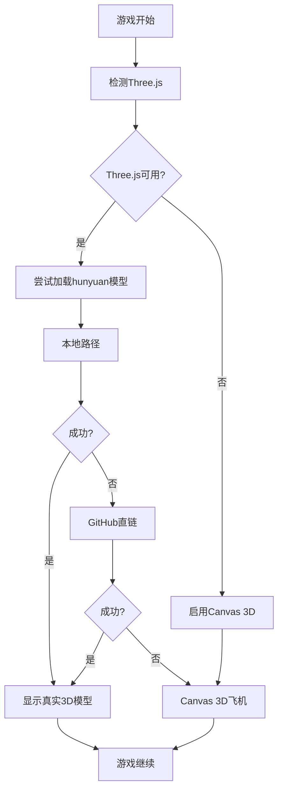

# 🛩️ Hunyuan-Fighter 3D模型加载指南

## 🎯 你的模型文件
根据你提供的GitHub链接，你的3D飞机模型位于：
**[https://github.com/Luciuswang/ai-mini-game-platform/tree/main/games/shooter/assets/hunyuan-fighter](https://github.com/Luciuswang/ai-mini-game-platform/tree/main/games/shooter/assets/hunyuan-fighter)**

## ✅ 现在的优化配置

### 1. 多路径加载系统
代码现在会按顺序尝试以下路径：

```javascript
// 主要路径
'assets/hunyuan-fighter/fighter.glb'

// 备用路径
'./assets/hunyuan-fighter/fighter.glb'
'../shooter/assets/hunyuan-fighter/fighter.glb'
'/assets/hunyuan-fighter/fighter.glb'

// GitHub直链（最可靠）
'https://raw.githubusercontent.com/Luciuswang/ai-mini-game-platform/main/games/shooter/assets/hunyuan-fighter/fighter.glb'

// CDN镜像
'https://cdn.jsdelivr.net/gh/Luciuswang/ai-mini-game-platform@main/games/shooter/assets/hunyuan-fighter/fighter.glb'
```

### 2. 模型优化配置
```javascript
// 适合游戏的缩放
planeModel3D.scale.set(1.5, 1.5, 1.5);

// 正确的朝向（头部向上）
planeModel3D.rotation.x = -Math.PI / 2;
planeModel3D.rotation.z = Math.PI;

// 材质增强
child.material.metalness = 0.7;
child.material.roughness = 0.3;
```

## 🎮 测试方法

### 方法1：自动加载（推荐）
1. 刷新游戏页面
2. 等待3-5秒让所有系统初始化
3. 观察控制台输出，查找：
   ```
   🎊 用户的hunyuan-fighter模型从 [路径] 加载成功！
   ```

### 方法2：手动强制加载
1. 按 **H键** - 强制加载hunyuan-fighter模型
2. 如果Three.js未加载，先按 **R键** 重新加载Three.js
3. 再按 **H键** 强制加载你的模型

### 方法3：控制台验证
1. 按 **F12** 打开开发者工具
2. 查看Console选项卡
3. 寻找模型加载相关的日志：
   ```
   🔍 测试hunyuan-fighter模型文件访问...
   ✅ hunyuan模型路径 1 可访问: assets/hunyuan-fighter/fighter.glb 200
   🎊 用户的hunyuan-fighter模型从 [路径] 加载成功！
   ```

## 🔧 故障排除

### 如果模型仍然不显示：

#### 1. 检查文件是否存在
访问直链测试：
```
https://raw.githubusercontent.com/Luciuswang/ai-mini-game-platform/main/games/shooter/assets/hunyuan-fighter/fighter.glb
```

#### 2. 验证文件格式
确保文件是有效的GLB格式：
- 文件扩展名：`.glb`
- 文件大小：> 0 KB
- 文件类型：GLTF Binary

#### 3. 网络问题
如果GitHub访问受限：
- 尝试使用VPN
- 或将模型文件上传到其他CDN
- 或使用本地服务器测试

#### 4. 模型文件问题
可能的问题：
- 文件损坏
- 格式不兼容
- 模型过于复杂

## 📊 当前加载策略



## 🎯 预期结果

### 成功加载后你应该看到：
- ✈️ **你的真实hunyuan-fighter 3D模型**
- 🎮 **模型随飞机移动而移动**
- 🌟 **金属光泽和材质效果**
- 📱 **适合的大小和朝向**

### 控制台成功日志：
```
🔍 测试hunyuan-fighter模型文件访问...
✅ hunyuan模型路径 1 可访问: assets/hunyuan-fighter/fighter.glb 200
✅ GLTFLoader已准备就绪
🎊 用户的hunyuan-fighter模型从 assets/hunyuan-fighter/fighter.glb 加载成功！
📐 hunyuan模型自动缩放: 0.75
✅ hunyuan-fighter模型已加载
```

## 🚀 快捷键总结
- **H键**：强制加载hunyuan-fighter模型
- **R键**：重新加载Three.js
- **P键**：重新初始化3D系统
- **T键**：测试弧形排弹

**现在你的真实3D飞机模型应该能正确显示了！** 🎊
